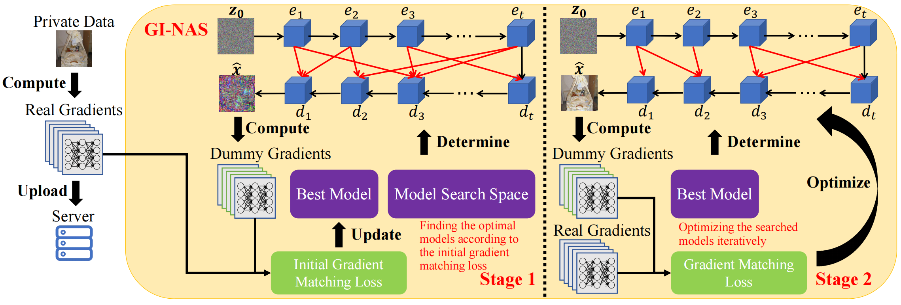

# GI-NAS: Boosting Gradient Inversion Attacks through Adaptive Neural Architecture Search

This repository provides the official PyTorch implementation of our work *"GI-NAS: Boosting Gradient Inversion Attacks through Adaptive Neural Architecture Search"*, which has been accepted for publication at **IEEE Transactions on Information Forensics & Security 2025**.

If you have any concerns when using this repository, feel free to contact me (Email: wenbo.research@gmail.com).

## Pipeline



## Visualization


## Setup

Install the conda environment and activate it as follows:

```
conda env create -f environment.yml
conda activate gi_nas
```

## Attack & Evaluation

Change the configurations in `runcifar10.py` and `runimagenet.py`, and then run:

```
python runcifar10.py
python runimagenet.py
```

## Citation

```
@article{yu2024gi,
  title={Gi-nas: Boosting gradient inversion attacks through adaptive neural architecture search},
  author={Yu, Wenbo and Fang, Hao and Chen, Bin and Sui, Xiaohang and Chen, Chuan and Wu, Hao and Xia, Shu-Tao and Xu, Ke},
  journal={arXiv preprint arXiv:2405.20725},
  year={2024}
}
```

## Acknowledgement

Our code is based on [GION](https://github.com/czhang024/CI-Net) and [ISNAS-DIP](https://github.com/ozgurkara99/ISNAS-DIP). For the other gradient inversion methods compared in this paper, we adopt the implementations from [GIFD](https://github.com/ffhibnese/GIFD_Gradient_Inversion_Attack). We sincerely appreciate their contributions to our community!
